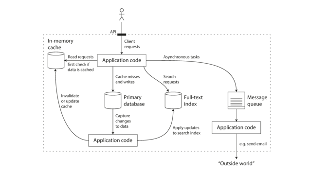

# Foundations
Nowadays CPU is barely a limiting factor for most of the apps, it the memory

A data-intensive application is typically built from standard building blocks that provide commonly
needed functionality. For example, many applications need to:

- Store data so that they, or another application, can find it again later (databases)
- Remember the result of an expensive operation, to speed up reads (caches)
- Allow users to search data by keyword or filter it in various ways (search indexes)
- Send a message to another process, to be handled asynchronously (stream processing)
- Periodically crunch a large amount of accumulated data (batch processing)”

> Increasingly many applications now have such demanding or wide-ranging requirements that a
single tool can no longer meet all of its data processing and storage needs. Instead, the work is
broken down into tasks that can be performed efficiently on a single tool, and those different
tools are stitched together using application code

  
 
sample system

# Reliability
System should be 
- fault-tolerant to user inputs 
- function well under normal load conditions
- should perform the expected functionality

## How Important It is
- Reliability is not just for nuclear power stations and air traffic control software—more mundane
applications are also expected to work reliably. Bugs in business applications cause lost
productivity (and legal risks if figures are reported incorrectly), and outages of ecommerce sites
can have huge costs in terms of lost revenue and damage to reputation.

- Even in “noncritical” applications we have a responsibility to our users. Consider a parent who
stores all their pictures and videos of their children in your photo application
[15]. How would they feel if that database was suddenly corrupted?
Would they know how to restore it from a backup?

- There are situations in which we may choose to sacrifice reliability in order to reduce development
cost (e.g., when developing a prototype product for an unproven market) or operational cost (e.g., for
a service with a very narrow profit margin)—but we should be very conscious of when we are
cutting corners.”

  >  “reliability as
  meaning, roughly, “continuing to work correctly, even when things go wrong.”
  
## Hardware faults
### Problems
- Disk can fail after sometime like in years
- Network outages
- Natural calamities in datacenters
- RAM becomes faulty
- The power grid has a blackout
- Someone unplugs the wrong network cable
- Moreover, in
  some cloud platforms such as Amazon Web Services (AWS) it is fairly common for virtual machine instances
  to become unavailable without warning, as the platforms are designed to
  prioritize flexibility and elasticity
  over single-machine reliability.
- Even for any OS/Software upgrades, downtimes on your own (Not a fault)
### Solutions
- Adding Redundancy to machines (Availability Zones)
- Keeping Backups in different datacenters
- Rolling Upgrade
## Software faults

### Problems
- A software bug that causes every instance of an application server to crash when given a
  particular bad input. For example, consider the leap second on June 30, 2012, that caused many
  applications to hang simultaneously due to a bug in the Linux kernel
- A runaway process that uses up some shared resource—CPU time, memory, disk space, or network
  bandwidth
- A service that the system depends on that slows down, becomes unresponsive, or starts returning
  corrupted responses
- Cascading failures, where a small fault in one component triggers a fault in another component,
  which in turn triggers further faults
> The bugs that cause these kinds of software faults often lie dormant for a long time until they are
triggered by an unusual set of circumstances. In those circumstances, it is revealed that the
software is making some kind of assumption about its environment—and while that assumption is
usually true, it eventually stops being true for some reason
### Solutions
- There is no quick solution to the problem of systematic faults in software
- carefully thinking about assumptions and interactions in the system
- thorough testing
- process isolation
- allowing processes to crash and restart
- measuring, monitoring, and analyzing system
  behavior in production

## Human error
Ahh.... here we go. This is the one which can go wrong easily as there can be continuous development and deployment on the systems.  
Also many people are involved in this.
> Even when they have the best intentions, humans are known to be unreliable. For example, one
study of large internet services found that configuration errors by operators were the leading cause
of outages, whereas hardware faults (servers or network) played a role in only 10–25% of outages.
### Problems
- You can just write bad code or bad architecture or managed something bad
### Solutions
- Design systems in a way that minimizes opportunities for error
- Decouple the places where people make the most mistakes from the places where they can cause
  failures
- Provide fully featured non-production sandbox environments where
  people can explore and experiment safely, using real data, without affecting real users
- Test thoroughly at all levels, from unit tests to whole-system integration tests and manual tests
- Allow quick and easy recovery from human errors, to minimize the impact in the case of a failure.
  For example, make it fast to roll back configuration changes, roll out new code gradually (so that
  any unexpected bugs affect only a small subset of users), and provide tools to recompute data (in
  case it turns out that the old computation was incorrect)”
- Set up detailed and clear monitoring, such as performance metrics and error rates.
- Implement good management practices and training - Code Review, Design Review, Infra Review, Mostly Reviews and Feedback

## Monitoring / Can be caught by
- Adding Application metrics Error Metrics, RPS Metrics, Latency Metrics
- Adding Open tracing to find where stuff is going bad
- Adding Hardware metrics like CPU usage, Disk IO, Memory metrics, Network metrics
- Adding Software metrics like JVM Threads, GC, Heap memory etc
- Alerts on all above within desired/assumed thresholds

# Scalability

# Maintainability