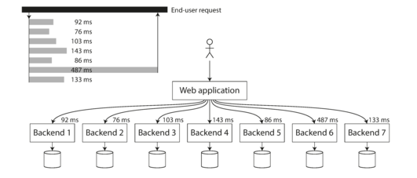

# Scalability
You know what it is. The app which worked in your dev environment should be able to support real traffic without performance degrading
## Possible Reasons
- Number of requests have increased from the client, A server can handle only some max concurrency (Network, CPU)
- Volume of data has increased (Memory, Storage, CPU)
- When you increase a load parameter and keep the system resources (CPU, memory, network bandwidth,
  etc.) unchanged, how is the performance of your system affected?
- When you increase a load parameter, how much do you need to increase the resources if you want to
  keep performance unchanged?

> If a single service is slow in a system of orchestration, that alone is enough to fuck people

  
 
When several backend calls are needed to serve a request, it takes just a single slow backend request to slow down the entire end-user request

> In a batch processing system such as Hadoop, we usually care about throughput—the number of
records we can process per second, or the total time it takes to run a job on a dataset of a certain
size.iii In online systems, what’s usually more important is the service’s
response time—that is, the time between a client sending a request and receiving a response.

> Latency and response time are often used synonymously, but they are not the same. The response
time is what the client sees: besides the actual time to process the request (the service time),
it includes network delays and queueing delays. Latency is the duration that a request is waiting to
be handled—during which it is latent, awaiting service

p50, p90, p99, p999 -> You know already what these are. But you didn't realize how important p99 is.

### p99 is lesser bcoz of many how following reasons
- That users/requests are performing high throughput operations
- A system even happened around that time GC pause, Deployment etc.
- could be introduced by a context switch to a background
  process
- the loss of a network packet and TCP retransmission
- a page fault forcing a read from disk
- mechanical vibrations in the server rack
- Or bitch, you might have done some bad decisions on the dev or arch
>High percentiles of response times, also known as tail latencies

> For example, Amazon describes response time
requirements for internal services in terms of the 99.9th percentile, even though it only affects 1
in 1,000 requests. This is because the customers with the slowest requests are often those who have
the most data on their accounts because they have made many purchases—that is, they’re the most
valuable customers
[19].
It’s important to keep those customers happy by ensuring the website is fast for them: Amazon has
also observed that a 100 ms increase in response time reduces sales by 1%
[20],
and others report that a 1-second slowdown reduces a customer satisfaction metric by 16%

> “On the other hand, optimizing the 99.99th percentile (the slowest 1 in 10,000 requests) was deemed
too expensive and to not yield enough benefit for Amazon’s purposes. Reducing response times at very
high percentiles is difficult because they are easily affected by random events outside of your
control, and the benefits are diminishing”

> “percentiles are often used in service level objectives (SLOs) and service level
agreements (SLAs), “These metrics set
expectations for clients of the service and allow customers to demand a refund if the SLA is not
met”

> “When generating load artificially in order to test the scalability of a system, the load-generating
client needs to keep sending requests independently of the response time. If the client waits for
the previous request to complete before sending the next one, that behavior has the effect of
artificially keeping the queues shorter in the test than they would be in reality, which skews the
measurements”
## Solutions
> Scaling Stateless systems are easy, just spin up more machine.  
> But Stateful machines like DB, Kafka etc needs some engineering
- Vertical Scaling (Big Machine)
- Horizontal Scaling (More Machine)  